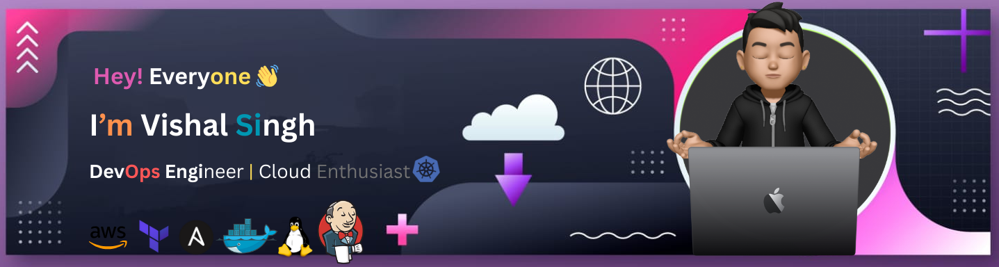

<h1 align="center">
  Hi 
  
  , I'm Vishal Singh
</h1>

<h3 align="center">DevOps Engineer | A Passionate Programmer | Full Stack Developer </h3>

 

### 💫 About Me

🔭 I’m currently working as DevOps Engineer at Paytm 
👯 I’m looking to collaborate on a real-life project  
🌱 I’m currently learning Kubernetes  
💬 Ask me about DevOps and Web Development 
🎵 I love Listening to Music 
⚡ **[Checkout My Portfolio Website](https://vishalsinghportfolio.netlify.app/)**  

### 🌐 Connect with me

  
  
  
  
  
  

### ⚡Coding Profile

  
  

### 💻 Tech Stack

                                     

### 📊 GitHub Stats

  
  

 

### 🔝 Top Contributed Repo

### GitHub Contribution Animation

 

 
<picture>
  <source media="(prefers-color-scheme: dark)" srcset="https://raw.githubusercontent.com/VishalSingh-07/VishalSingh-07/pacman-output/pacman-contribution-graph-dark.svg">
  <source media="(prefers-color-scheme: light)" srcset="https://raw.githubusercontent.com/VishalSingh-07/VishalSingh-07/pacman-output/pacman-contribution-graph.svg">
  
</picture>

### Profile View

 </img>

  
  <samp>
    <i>Thanks for visiting my profile.</i> 
  </samp>

